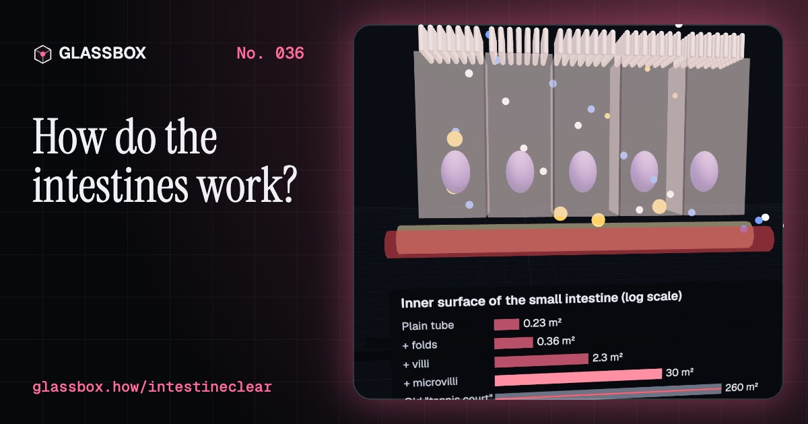
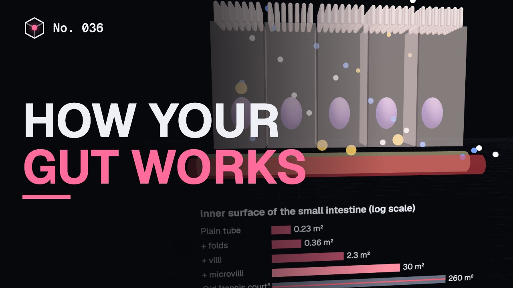
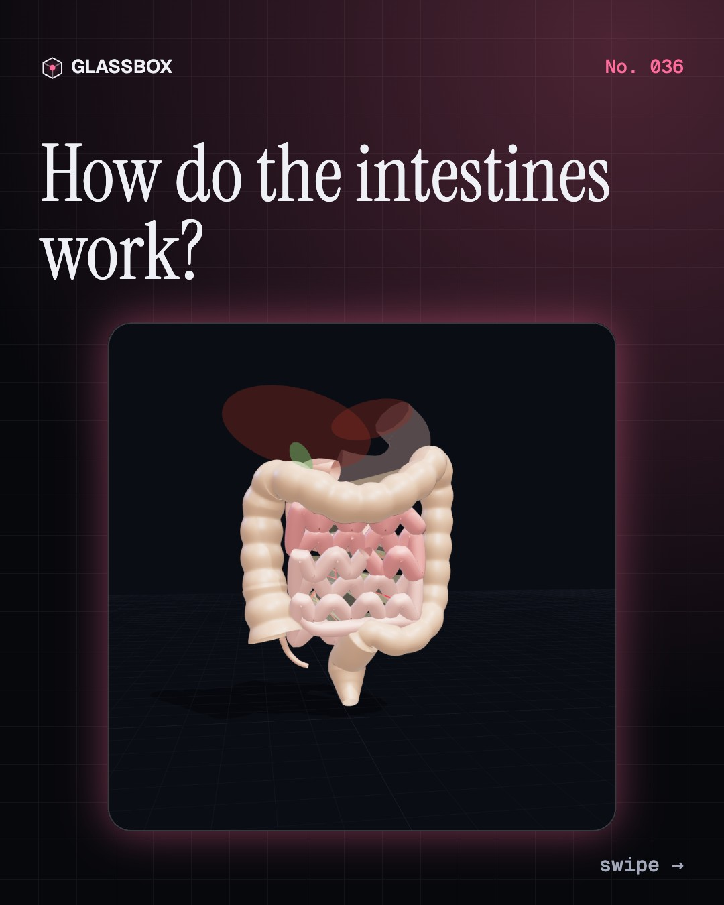
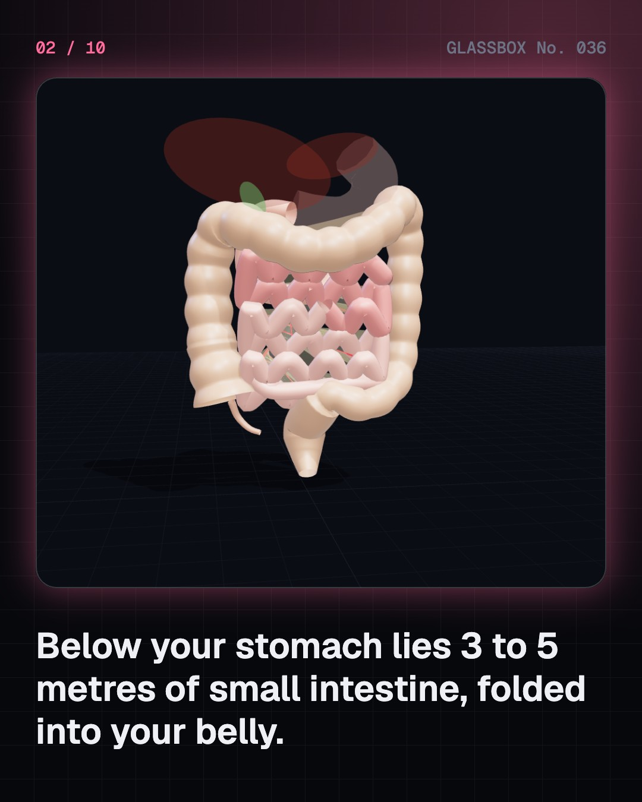
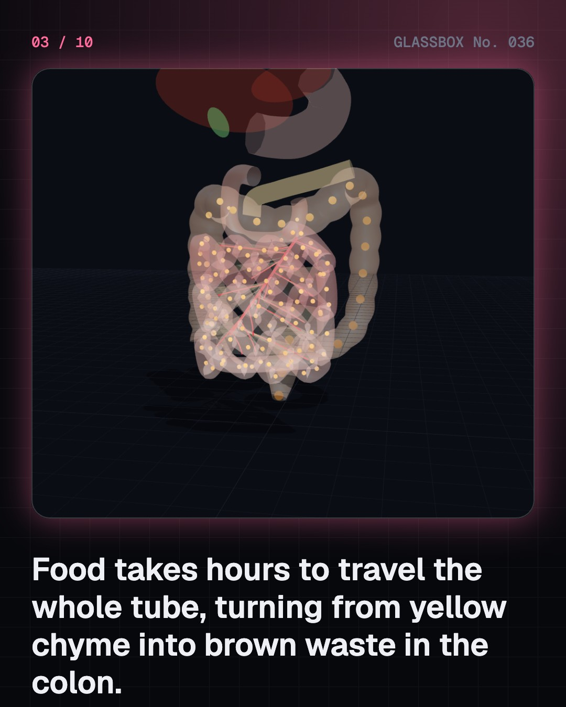
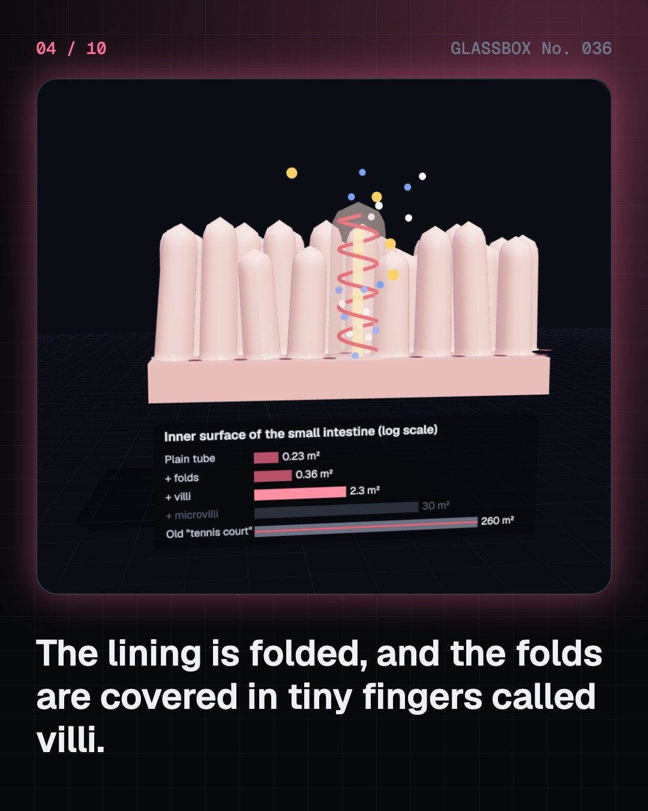

<!-- glassbox:start -->
<!-- Generated from glassbox.json by the Glassbox hub (npm run readme -- intestineclear). Edit glassbox.json, not this block. -->
<p align="center"><a href="https://glassbox.how/e/intestineclear/"></a></p>

<h1 align="center">IntestineClear</h1>

<p align="center"><b>How do the intestines work?</b><br>Between your stomach and the exit lies a folded tube 3 to 5 metres long, with an inner surface of about 30 square metres and 38 trillion bacteria living in it. Unpack the intestines in 3D, zoom down to the villi, and watch a meal of roti, dal and paneer get cut into molecules.</p>

<p align="center"><a href="https://glassbox.how/intestineclear/"><b>▶ Play with it</b></a> &nbsp;·&nbsp; <a href="https://glassbox.how/e/intestineclear/">Read the 60-second explainer</a> &nbsp;·&nbsp; <a href="https://glassbox.how/intestineclear/glassbox/reel.mp4">Watch the 40-second video</a></p>

<p align="center">
  <a href="https://glassbox.how/e/intestineclear/"></a>
  <a href="https://glassbox.how/e/intestineclear/"></a>
  <a href="LICENSE"></a>
  <a href="LICENSE-CONTENT.md"></a>
  <a href="#privacy"></a>
</p>

## In 60 seconds

1. **A long, folded tube.** After the stomach comes the small intestine: duodenum, jejunum and ileum, about 3 to 5 metres long in a living person (the 6 to 7 m in some books is measured after death, when the muscle has relaxed). The mesentery holds its coils. The large intestine, about 1.5 m, runs from the caecum and appendix up, across and down to the rectum.
2. **Folds on folds.** Circular folds, finger-like villi and the microvilli on every lining cell multiply the absorbing surface to about 30 square metres: half a badminton court, not the tennis court of old textbooks (Helander and Fändriks, 2014). Sugars and amino acids go into capillaries; fats go into the lacteals.
3. **Squeeze, mix, sweep.** Peristalsis squeezes behind the food and relaxes in front. Segmentation sloshes it back and forth to mix. Between meals a housekeeping wave, the migrating motor complex, sweeps the gut clean and makes it growl. Chyme takes about 2 to 6 hours through the small intestine and often 12 to 48 hours through the colon.
4. **Molecular scissors.** In the duodenum, bile from the liver breaks fat into droplets, and pancreatic juice brings enzymes and bicarbonate to neutralise stomach acid. Starch becomes glucose, proteins become amino acids, and fats become fatty acids and monoglycerides.
5. **38 trillion helpers.** The colon saves water, taking back nearly all of the 1.5 litres that reaches it, and houses about 38 trillion bacteria, roughly as many as your own cells, not ten times more. They ferment fibre into short-chain fatty acids that fuel the colon's lining.
6. **When things go wrong.** Diarrhoea can dehydrate, but ORS, salt and sugar in clean water, uses the sodium-glucose partnership to pull water back in: a discovery proven in Dhaka and Kolkata. Lactose intolerance, coeliac disease and appendicitis are explained as general facts. For your own gut, talk to a doctor.

## Words worth knowing

| Term | Meaning |
|---|---|
| **Chyme** | The soupy mix of part-digested food and stomach juice that enters the small intestine. |
| **Duodenum, jejunum, ileum** | The three parts of the small intestine, in order from the stomach. |
| **Mesentery** | The fan-shaped fold of tissue that holds the intestines and carries their blood vessels. |
| **Villi and microvilli** | Tiny fingers on the gut lining, and even tinier ones on each lining cell, that multiply its surface. |
| **Lacteal** | The lymph vessel inside each villus that takes in fats. |
| **Peristalsis** | A travelling wave of muscle contraction that pushes food along. |
| **Enzyme** | A protein that speeds up a reaction, such as cutting a big food molecule into small ones. |
| **Short-chain fatty acids** | Acids such as butyrate made by gut bacteria from fibre; they fuel the colon's lining. |
| **ORS** | Oral rehydration solution: water with a measured amount of salts and sugar that the gut can absorb even during diarrhoea. |

## A short history

**4,000 years from Egypt's 'shepherd of the anus' to swallowable cameras, a gut surface the size of a small flat, and a drink of salt, sugar and water that has saved millions of children.**

- **170** · Food is cooked, then turned into blood (Galen of Pergamon, Pergamon and Rome)
- **1622** · Milky vessels that carry fat (Gaspare Aselli, Milan, Italy)
- **1745** · Tiny fingers and pits (Johann Nathanael Lieberkühn, Leiden, Netherlands)
- **1825** · A window into a living stomach (William Beaumont and Alexis St. Martin, Mackinac Island, Michigan, USA)
- **1898** · Watching the gut move by X-ray (Walter B. Cannon, Harvard Medical School, Boston, USA)
- **1902** · A chemical message from the gut (William Bayliss and Ernest Starling, University College London, England)
- **1907** · Good bacteria in yogurt (Élie Metchnikoff and Stamen Grigorov, Paris, France and Geneva, Switzerland)
- **1960** · Sodium and sugar travel together (Robert K. Crane, Prague, Czechoslovakia (worked in St. Louis, USA))

The full story, with 30 moments, charts, people and 60 sources: [glassbox.how/e/intestineclear/history](https://glassbox.how/e/intestineclear/history/). The data lives in [`history.json`](history.json).

## Video and slides

Made with the Glassbox studio from this box's storyboard (`window.glassbox.director`). Free to reuse under CC BY 4.0.

<a href="https://glassbox.how/intestineclear/glassbox/video.mp4"></a>

<p><a href="glassbox/slide-1.jpg"></a> <a href="glassbox/slide-2.jpg"></a> <a href="glassbox/slide-3.jpg"></a> <a href="glassbox/slide-4.jpg"></a></p>

| File | What | Size |
|---|---|---|
| [`glassbox/reel.mp4`](https://glassbox.how/intestineclear/glassbox/reel.mp4) | Reel / Short, with captions and soundtrack | 1080×1920 |
| [`glassbox/video.mp4`](https://glassbox.how/intestineclear/glassbox/video.mp4) | YouTube video, with captions and soundtrack | 1920×1080 |
| `glassbox/slide-1…10.jpg` | Instagram carousel | 1080×1350 |
| `glassbox/thumb.jpg` | YouTube thumbnail | 1280×720 |
| `glassbox/cover.jpg` | Share card and repo social preview | 1200×630 |
| [`glassbox/history-reel.mp4`](https://glassbox.how/intestineclear/glassbox/history-reel.mp4) | “History in 10 moments” Reel / Short | 1080×1920 |
| `glassbox/history-slide-*.jpg` | History carousel | 1080×1350 |
| `glassbox/post.json` | Post copy and schedule used by the publish kit | |

## Privacy

This box has no accounts and no ads, and it ships its own fonts and libraries. When you run it yourself it sends nothing anywhere. On glassbox.how, the site's `/bar.js` also loads Glassbox's analytics: **Google Analytics** to count visits (it asks first in the EU, UK and Switzerland, and stays off when your browser sends Global Privacy Control or Do Not Track) and **ClickTrust** to detect bots.

It remembers a few things **in your own browser only**, and never sends them anywhere:

| Browser storage key | What it holds |
|---|---|
| `intestineclear.v1` | Which chapters you have opened, your best quiz scores, and sound on or off. |

Exactly what each one sees is at [glassbox.how/privacy](https://glassbox.how/privacy/).

## Licences

- **Code:** [MIT](LICENSE). Use it, change it, ship it.
- **Explanations, text, images and videos** (`glassbox.json`, `glassbox/`): [CC BY 4.0](LICENSE-CONTENT.md). Credit “Glassbox, glassbox.how/e/intestineclear”.
- **Third-party parts** keep their own licences: [three.js](https://threejs.org) (MIT), [Geist, Instrument Serif](https://openfontlicense.org) (SIL OFL 1.1).
- The Glassbox name and logo aren't covered by either licence. See the [terms](https://glassbox.how/terms/).

Found a mistake? [Open an issue](https://github.com/bdeeps/intestineclear/issues). Corrections happen in public.
<!-- glassbox:end -->

## Run it

It's plain HTML, CSS and JavaScript. No build step and no dependencies. Run locally, it contacts no other website.

```bash
python3 -m http.server 8000
```

Three.js and the fonts ship in `vendor/` and `fonts/`, so it also works offline.

Then open http://localhost:8000.

## How it's built

| File | What |
|---|---|
| `index.html`, `css/app.css` | The page and its styles |
| `js/app.js`, `js/stage.js`, `js/ui.js`, `js/kit.js` | The shared Glassbox 3D engine: chapters, 3D stage, controls, quiz, video director |
| `js/chapters/*.js` | One file per chapter: the 3D model, controls, text, key terms, quiz and video scenes |
| `glassbox.json` | Title, question, explainer beats, key terms, browser storage and credits shown on glassbox.how |
| `reel` in each chapter | The storyboard the Glassbox studio records into short videos |
| `glassbox/` | The published video, slides, thumbnail and post copy |
| `fonts/`, `vendor/three/` | Self-hosted Geist and Instrument Serif (SIL OFL 1.1) and three.js (MIT) |
